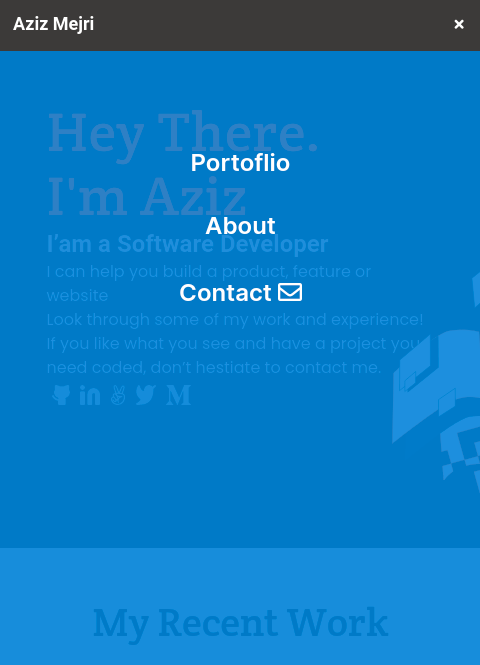

# curriculum-cr-training-mobile-menu

Application is based on this [Figma design](https://www.figma.com/file/t3EJUCAEViw3QasuJLPLVT/Microverse-Student-Potfolio-Templates-Main?node-id=1%3A1471).


## About
> This is based on a portfolio website for Aziz Mejri. It showcases his various projects and accomplishments.
The focus in this particular project is the addon of a mobile menu.

### Nav Menu
|  | |
|:---:|:---:|
| Closed Menu | Open Menu |

## Built With

- HTML5 & CSS3
- No frameworks

## Instructions
To get a local copy up and running follow these simple example steps.

### Prerequisites
- Gitbash installed to navigate between the branches.
- A preferred text editor for example VS Code.
- A browser such as Google Chrome

### Install
Clone this [GitHub Repo](https://github.com/KabohaJeanMark/mobile-menu) to your computer on yourFolder by typing these commands in the terminal or download as a Zip file and extract.
```
$ mkdir yourFolder
$ cd yourFolder
$ git clone https://github.com/KabohaJeanMark/mobile-menu
```

### Usage
- View with live Server in VS code or Right click and open the index.html in your browser to view.

## Author

👤 **Kaboha Jean Mark**

- GitHub: [@KabohaJeanMark](https://github.com/KabohaJeanMark)
- Twitter: [@jean_quintus](https://twitter.com/jean_quintus)
- LinkedIn: [Jean Mark Kaboha](https://www.linkedin.com/in/jean-mark-kaboha-software-engineer/)


## 🤝 Contributing

Contributions, issues, and feature requests are welcome!

Feel free to check the [issues page](https://github.com/KabohaJeanMark/jersey-directory/issues).

## Show your support

Give a ⭐️ if you like this project!

## Acknowledgments

- Hat tip to Microverse for the README template, instructions and tutoring for this Capstone project.

## Inspirations
- Application is based on this [Figma design](https://www.figma.com/file/t3EJUCAEViw3QasuJLPLVT/Microverse-Student-Potfolio-Templates-Main?node-id=1%3A1471).

## 📝 License

This project is [MIT](./LICENSE) licensed.